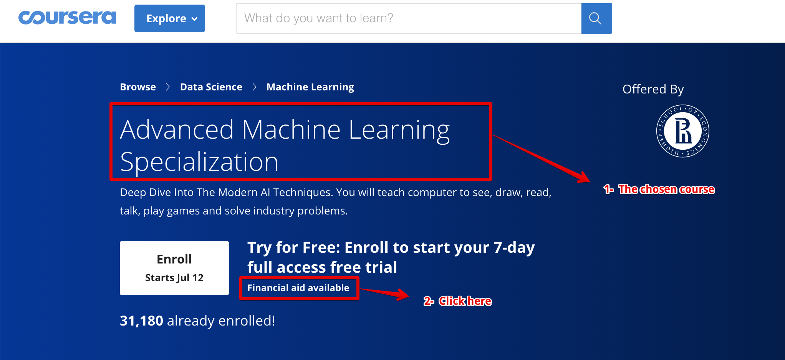
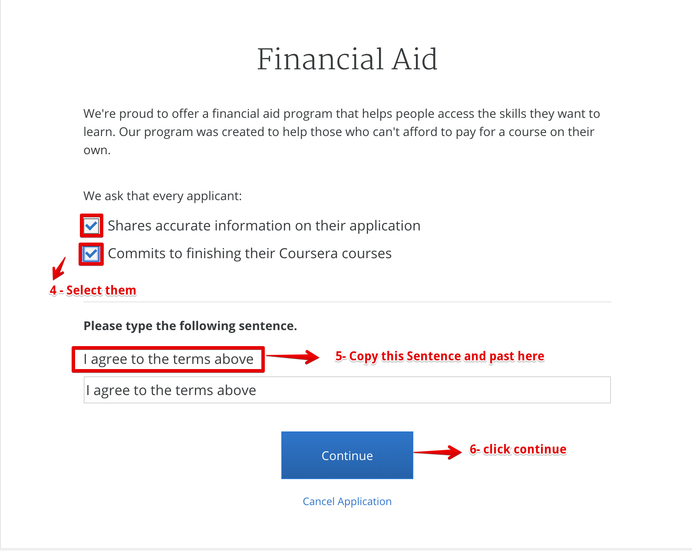
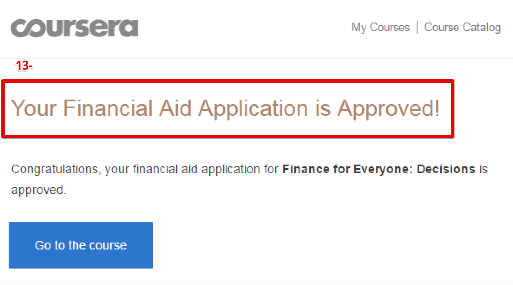

# Applying for financial aid on coursera 

## You should change everything between the quotes

## Why are you applying for Financial Aid? (150 words minimum required)
Hello, my name is "your name" and I live in "your country", the country in development. I'm applying for Financial Aid for the course "Course name" because I do not have any special source of income, I don't earn enough money, and I can't afford the full tuition at this time of my life and career.
Receiving Financial Aid for this course will help me get valuable knowledge in "write your career neme like machine learening",  and I have been searching for a job for a long time in order to earn money for this course, but no luck so far, so receiving financial aid will allow me to focus on my studies and by taking it I will be able to get a paid internship and take another course in "your path" path.
I want to invest in my career and my education, but at this moment I can only invest in my time to increase my knowledge and advance in my career, not the money. Hopefully this will change in the upcoming years because I am ambitious, I want to increase my programming knowledge and new technologies, I am eager to work and I hope to advance in my career.

## How will taking this course help you achieve your career goals? (150 words minimum required)
I have a solid background in "insert relevant skill here, like maths, algorithms, and problem-solving skills", so I am eager to learn "your path" and that course is the first step for me to create projects that will aid in humanity's wellfare. 
My main career goal is to learn every day; I really want to learn, and to progress in my career.
"Your path" requires constant learning and improving, taking this course can help me advance my knowledge.

I plan on gaining additional skills by taking related classes and continuing my involvement with a variety of professional associations. I noticed that there a lot of companies providing internships and jobs in the related filled, and I would certainly be interested in taking it and improving my self to be one of the pioneer of "your path".
There are many opportunities in this field that the candidate can join but they must have good knowledge in order to join these opportunities, so I believe that this course, with its impressive tutorials and exercises, will enable me to join the world's largest companies in this area

## If you answered no, please help us understand why?
Because there are a lot of developing countries where the average rate of income is low and there are not enough personal needs for home so it isn't enough to get paid courses, and we need a lot of free courses for learning and improving ourselves in order to help develop our countries and benifit humanity.
